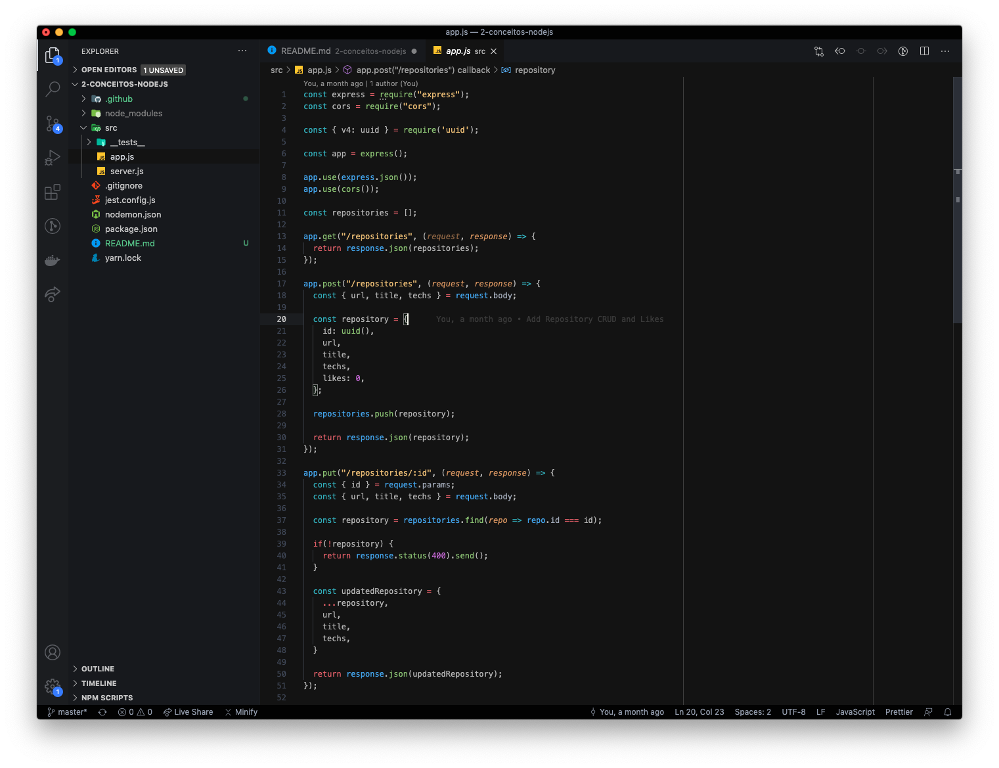
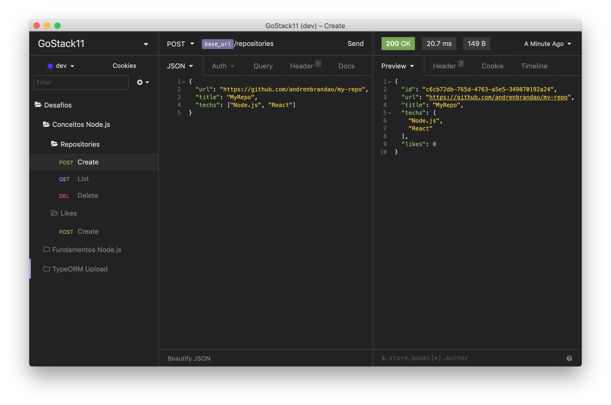

  

<h3 align="center">
  Desafio 02: Conceitos do Node.js
</h3>

  <a href="#rocket-sobre-o-desafio">Sobre o desafio</a>&nbsp;&nbsp;&nbsp;|&nbsp;&nbsp;&nbsp;
  <a href="#hammer_and_wrench-tecnologias">Tecnologias</a>&nbsp;&nbsp;&nbsp;|&nbsp;&nbsp;&nbsp;
  <a href="#memo-licença">Licença</a>

## :rocket: Sobre o desafio

Aplicação criada para o [Desafio 02](https://github.com/rocketseat-education/bootcamp-gostack-desafios/tree/master/desafio-conceitos-nodejs) do Bootcamp GoStack 11 da Rocketseat.

Essa é uma aplicação para armazenar repositórios de um portfólio, que irá permitir a criação, listagem, atualização e remoção dos repositórios, e além disso permitir que os repositórios possam receber "likes".

### Rotas da aplicação

As rotas principais da aplicação são:

- **`POST /repositories`**: A rota recebe `title`, `url` e `techs` dentro do corpo da requisição, sendo a URL o link para o github desse repositório. Ao cadastrar um novo projeto, ele é armazenado dentro de um objeto no seguinte formato: `{ id: "uuid", title: 'Desafio Node.js', url: 'http:cd .//github.com/...', techs: ["Node.js", "..."], likes: 0 }`;

- **`GET /repositories`**: Rota que lista todos os repositórios;

- **`PUT /repositories/:id`**: A rota altera apenas o `title`, a `url` e as `techs` do repositório que possua o `id` igual ao `id` presente nos parâmetros da rota;

- **`DELETE /repositories/:id`**: A rota deleta o repositório com o `id` presente nos parâmetros da rota;

- **`POST /repositories/:id/like`**: A rota aumenta o número de likes do repositório específico escolhido através do `id` presente nos parâmetros da rota.

## :hammer_and_wrench: Tecnologias

As seguintes ferramentas foram usadas na construção do projeto:

- [Node.js](https://nodejs.org/en/)
- [Insomnia](https://insomnia.rest/)
- [VSCode](https://code.visualstudio.com/)

## :memo: Licença

Esse projeto está sob a licença MIT. Veja o arquivo [LICENSE](LICENSE) para mais detalhes.