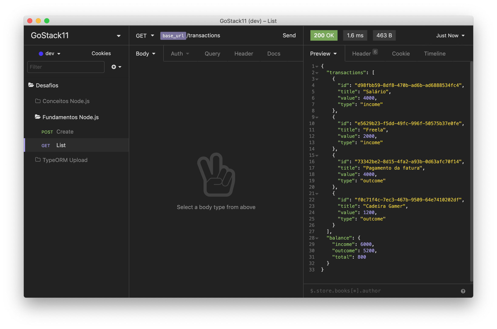

<div align="center">
  
</div>

<h3 align="center">
  Desafio 05: Primeiro projeto Node.js
</h3>

<p align="center">
  <a href="#rocket-sobre-o-desafio">Sobre o desafio</a>&nbsp;&nbsp;&nbsp;|&nbsp;&nbsp;&nbsp;
  <a href="#hammer_and_wrench-tecnologias">Tecnologias</a>&nbsp;&nbsp;&nbsp;|&nbsp;&nbsp;&nbsp;
  <a href="#memo-licença">Licença</a>
</p>

## :rocket: Sobre o desafio

Aplicação criada para o [Desafio 05](https://github.com/rocketseat-education/bootcamp-gostack-desafios/tree/master/desafio-fundamentos-nodejs) do Bootcamp GoStack 11 da Rocketseat.

Essa é uma aplicação para armazenar transações financeiras de entrada e saída, que permite o cadastro e a listagem dessas transações. As tecnologias foram Node.js junto ao TypeScript, utilizando o conceito de models, repositories e services.

### Rotas da aplicação

- **`POST /transactions`**: A rota recebe `title`, `value` e `type` dentro do corpo da requisição, sendo `type` o tipo da transação, que deve ser `income` para entradas (depósitos) e `outcome` para saídas (retiradas). Ao cadastrar uma nova transação, ela é armazenada dentro de um objeto com o seguinte formato:

```json
{
  "id": "uuid",
  "title": "Salário",
  "value": 3000,
  "type": "income"
}
```

<div align="center">
  
</div>

- **`GET /transactions`**: Essa rota retorna uma listagem com todas as transações que cadastradas até agora, junto com o valor de soma de entradas, retiradas e total de crédito. Essa rota retorna um objeto com o formato a seguir:

```json
{
  "transactions": [
    {
      "id": "uuid",
      "title": "Salário",
      "value": 4000,
      "type": "income"
    },
    {
      "id": "uuid",
      "title": "Freela",
      "value": 2000,
      "type": "income"
    },
    {
      "id": "uuid",
      "title": "Pagamento da fatura",
      "value": 4000,
      "type": "outcome"
    },
    {
      "id": "uuid",
      "title": "Cadeira Gamer",
      "value": 1200,
      "type": "outcome"
    }
  ],
  "balance": {
    "income": 6000,
    "outcome": 5200,
    "total": 800
  }
}
```

<div align="center">
  
</div>


## :hammer_and_wrench: Tecnologias

As seguintes ferramentas foram usadas na construção do projeto:

- [Node.js](https://nodejs.org/en/)
- [TypeScript](https://www.typescriptlang.org/)

## :memo: Licença

Esse projeto está sob a licença MIT. Veja o arquivo [LICENSE](LICENSE) para mais detalhes.
