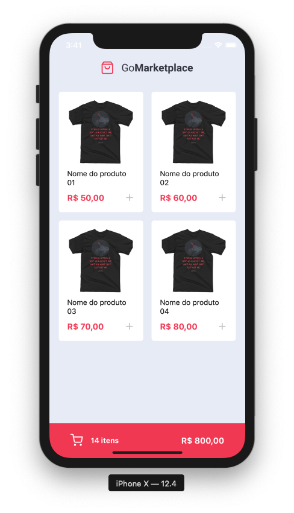
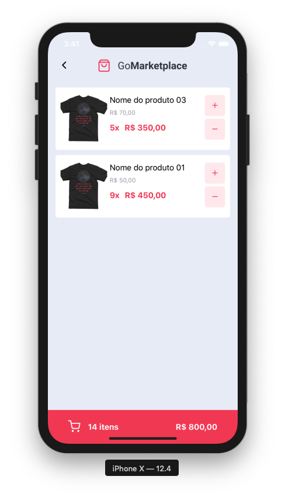

<div align="center">
  
</div>

<h3 align="center">
  Desafio 08: Fundamentos do React Native
</h3>

<p align="center">
  <a href="#rocket-sobre-o-desafio">Sobre o desafio</a>&nbsp;&nbsp;&nbsp;|&nbsp;&nbsp;&nbsp;
  <a href="#hammer_and_wrench-tecnologias">Tecnologias</a>&nbsp;&nbsp;&nbsp;|&nbsp;&nbsp;&nbsp;
  <a href="#memo-licença">Licença</a>
</p>

## :rocket: Sobre o desafio

Aplicação criada para o [Desafio 08](https://github.com/rocketseat-education/bootcamp-gostack-desafios/tree/master/desafio-fundamentos-react-native) do Bootcamp GoStack 11 da Rocketseat.

Desenvolvimento de uma nova aplicação, a GoMarketplace. Exercício para praticar desenvolvimento com React Native junto com o TypeScript, utilizando rotas, Async Storage e a Context API.

### Utilizando uma fake API

Foi utilizada uma fake API para facilitar o desenvolvimento.

Para isso, foi instalada no package.json uma dependência chamada `json-server`, e um arquivo chamado `server.json` que contém os dados para uma rota `/products`. Para executar esse servidor você pode executar o seguinte comando:

```js
  yarn json-server server.json -p 3333
```

### Funcionalidades da aplicação

<div align="center">
  
</div>

- **`Listar os produtos da fake API`**: A página `Dashboard` é capaz de exibir uma listagem através de uma tabela, com os campos `title`, `image_url` e `price`.

- **`Adicionar itens ao carrinho`**: Em toda sua aplicação, é utilizado o Contexto chamado `cart`.

<div align="center">
  
</div>

- **`Exibir itens do carrinho`**: Na página `Cart` é exibido todos os itens do carrinho, junto com a quantidade, valor único, valor subtotal dos itens e total de todos os items.

- **`Aumentar quantidade de itens do carrinho`**: Na página `Cart` é permitido que o usuário aumente a quantidade de itens do mesmo produto, para isso é utilizada a função `increment` dentro do seu contexto em `/src/hooks/cart.tsx`.

- **`Diminuir quantidade de um item do carrinho`**: Na página `Cart` é permitido que o usuário decremente a quantidade de itens do mesmo produto, para isso é utilizada a função `decrement` dentro do seu contexto em `/src/hooks/cart.tsx`.

- **`Exibir valor total dos itens no carrinho`**: Tanto na página `Dashboard`, tanto na página `Cart` é exibido o valor total de todos os itens que estão no seu carrinho.

## :hammer_and_wrench: Tecnologias

As seguintes ferramentas foram usadas na construção do projeto:

- [React Native](https://reactnative.dev/)
- [TypeScript](https://www.typescriptlang.org/)

## :memo: Licença

Esse projeto está sob a licença MIT. Veja o arquivo [LICENSE](LICENSE) para mais detalhes.
