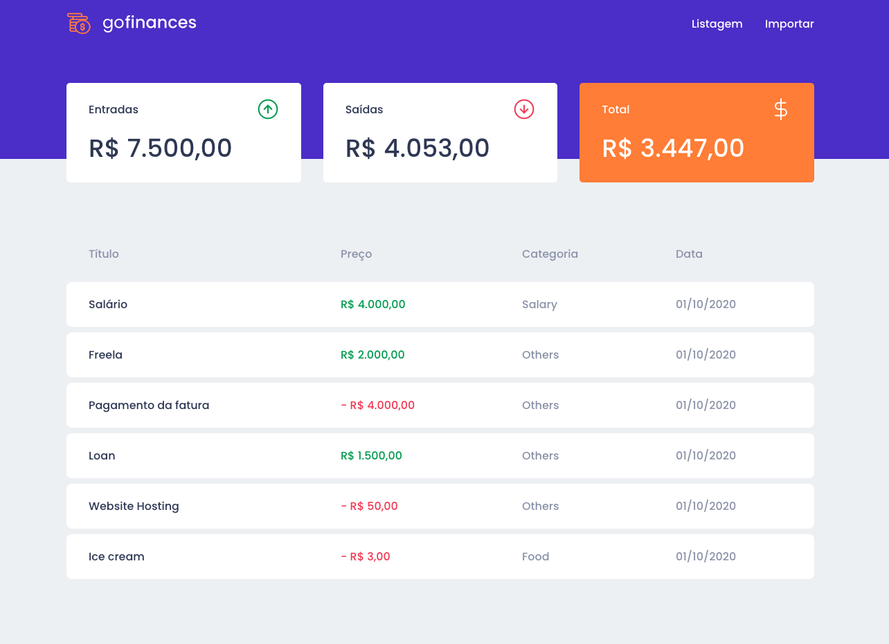
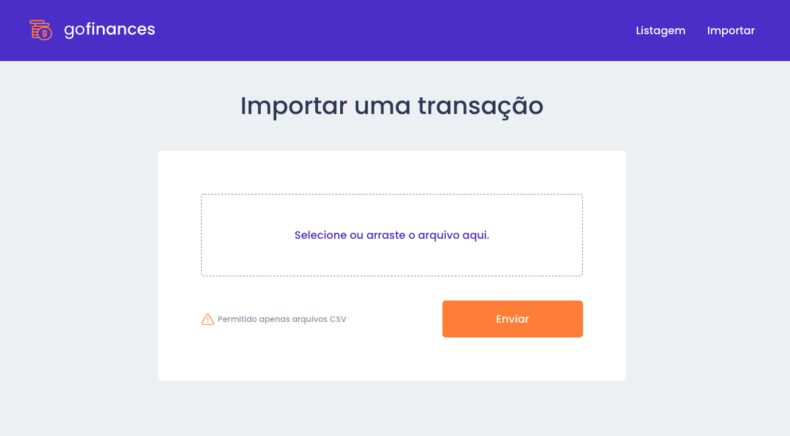

  

<h3 align="center">
  Desafio 07: GoFinances Web
</h3>

  <a href="#rocket-sobre-o-desafio">Sobre o desafio</a>&nbsp;&nbsp;&nbsp;|&nbsp;&nbsp;&nbsp;
  <a href="#hammer_and_wrench-tecnologias">Tecnologias</a>&nbsp;&nbsp;&nbsp;|&nbsp;&nbsp;&nbsp;
  <a href="#memo-licença">Licença</a>

## :rocket: Sobre o desafio

Aplicação criada para o [Desafio 07](https://github.com/rocketseat-education/bootcamp-gostack-desafios/tree/master/desafio-fundamentos-reactjs) do Bootcamp GoStack 11 da Rocketseat.

Frontend feito em ReactJS para se conectar ao backend do [Desafio 06](https://github.com/andrenbrandao/bootcamp-gostack11-desafio-typeorm-upload), exibir as transações criadas e permitir a importação de um arquivo CSV para gerar novos registros no banco de dados.

### Funcionalidades da aplicação

- **`Listar as transações da API`**: A página `Dashboard` é capaz de exibir uma listagem através de uma tabela, com o campo `title`, `value`, `type` e `category` de todas as transações que estão cadastradas na sua API.

- **`Exibir o balance da API`**: A página `Dashboard` exibe o balance que é retornado do backend, contendo o total geral, junto ao total de entradas e saídas.

  

- **`Importar arquivos CSV`**: Na página `Import`, pode-se enviar um arquivo no formato `csv` para o backend, que irá fazer a importação das transações para o seu banco de dados. O arquivo csv deve seguir o seguinte [modelo](https://github.com/andrenbrandao/bootcamp-gostack11-desafio-typeorm-upload/blob/master/.github/file.csv).

  

## :hammer_and_wrench: Tecnologias

As seguintes ferramentas foram usadas na construção do projeto:

- [ReactJS](https://reactjs.org/)
- [TypeScript](https://www.typescriptlang.org/)
- [Axios](https://github.com/axios/axios)
- [Styled Components](https://styled-components.com/)

## :memo: Licença

Esse projeto está sob a licença MIT. Veja o arquivo [LICENSE](LICENSE) para mais detalhes.
