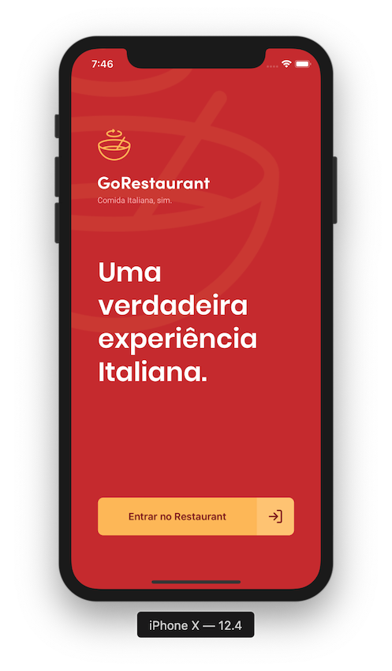
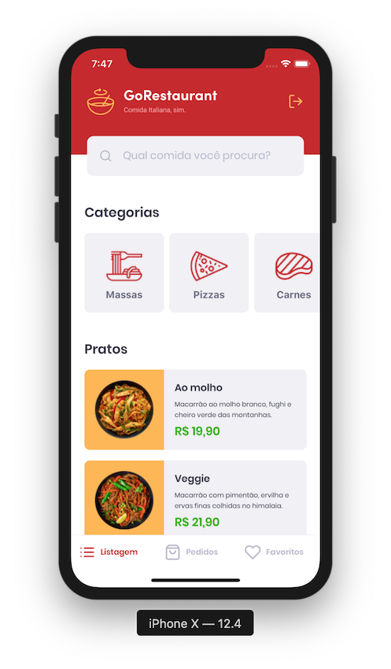
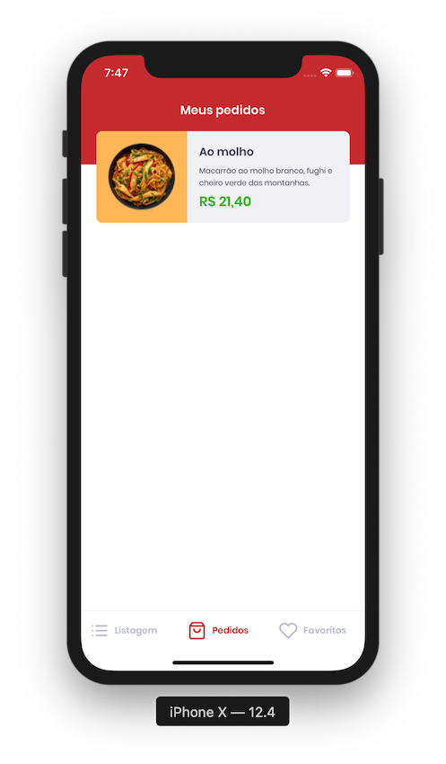
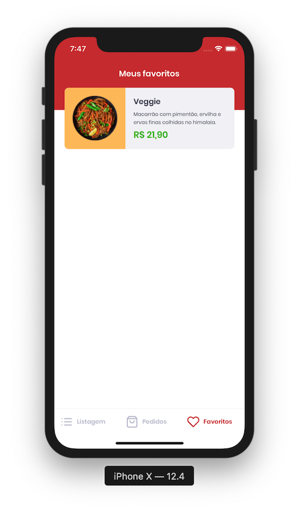
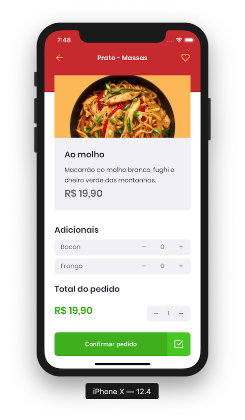

<div align="center">
  
</div>

<h3 align="center">
  Desafio 11: GoRestaurant Mobile
</h3>

<p align="center">
  <a href="#rocket-sobre-o-desafio">Sobre o desafio</a>&nbsp;&nbsp;&nbsp;|&nbsp;&nbsp;&nbsp;
  <a href="#hammer_and_wrench-tecnologias">Tecnologias</a>&nbsp;&nbsp;&nbsp;|&nbsp;&nbsp;&nbsp;
  <a href="#memo-licença">Licença</a>
</p>

## :rocket: Sobre o desafio

Aplicação criada para o [Desafio 11](https://github.com/rocketseat-education/bootcamp-gostack-desafios/tree/master/desafio-react-native-delivery) do Bootcamp GoStack 11 da Rocketseat.

Desenvolvimento da versão Mobile da GoRestaurant. Ela se conecta a uma Fake API, exibe e filtra os pratos de comida da API e permite a criação de novos pedidos.


<div align="center">
  
</div>


### Utilizando uma fake API

Foi instalada no seu package.json uma dependência chamada `json-server`, e um arquivo chamado `server.json` que contém os dados para as seguintes rotas:

**Rota `/foods`**: Retorna todas as comidas cadastradas na API

**Rota `/foods/:id`**: Retorna um prato de comida cadastradas na API baseado no `id`

**Rota `/categories`**: Retorna todas as categorias cadastradas na API

**Rota `/orders`**: Retorna todas os pedidos que foram cadastrados na API

**Rota `/favorites`**: Retorna todas as comidas favoritas que foram cadastrados na API

```js
  yarn json-server server.json -p 3333
```

### Funcionalidades da aplicação


- **`Listar os pratos de comida da API`**: A página `Dashboard` exibe uma listagem, com o campo `name`, `value` e  `description` de todos os pratos de comida que estão cadastrados na API.

- **`Listar as categorias da API`**: A página `Dashboard` exibe uma listagem, com o campo `title` e `image_url` de todas as categorias que estão cadastrados na API.

- **`Filtrar pratos de comida por busca ou por categorias`**: A página Dashboard permite que o input de pesquisa e os botões de categoria façam uma busca na API de acordo com o que estiver selecionado ou escrito no input.

<div align="center">
  
</div>

- **`Listar os pedidos da API`**: A página `Orders` exibe uma listagem, com o campo as informações do produto pedido, com `name` e `description` de todos os pedidos que estão cadastrados na API.

<div align="center">
  
</div>

- **`Listar os pratos favoritos da API`**: A página `Favorites` exibe uma listagem, com o campo as informações do produto favorito, com `name` e `description` de todos os pedidos que estão cadastrados na API.

<div align="center">
  
</div>

- **`Realizar um pedido`**: A página `Dashboard`, ao clicar em um item, redireciona o usuário para a página `FoodDetails`, onde é possível realizar um novo pedido, podendo controlar a quantidade desse item pedido, ou adicionar ingredientes extras. Todo o valor é calculado de acordo com a quantidade pedida.

<div align="center">
  
</div>

## :hammer_and_wrench: Tecnologias

As seguintes ferramentas foram usadas na construção do projeto:

- [React Native](https://reactnative.dev/)
- [TypeScript](https://www.typescriptlang.org/)

## :memo: Licença

Esse projeto está sob a licença MIT. Veja o arquivo [LICENSE](LICENSE) para mais detalhes.
