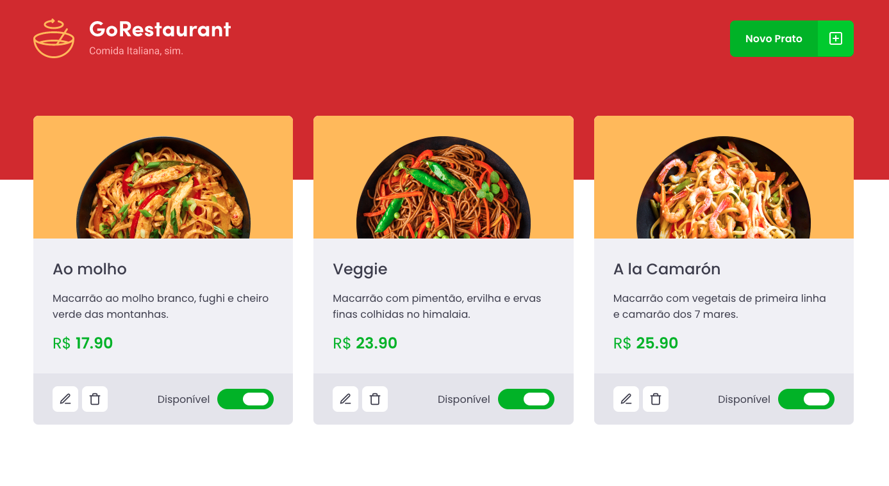

<div align="center">
  
</div>

<h3 align="center">
  Desafio 10: GoRestaurant Web
</h3>

<p align="center">
  <a href="#rocket-sobre-o-desafio">Sobre o desafio</a>&nbsp;&nbsp;&nbsp;|&nbsp;&nbsp;&nbsp;
  <a href="#hammer_and_wrench-tecnologias">Tecnologias</a>&nbsp;&nbsp;&nbsp;|&nbsp;&nbsp;&nbsp;
  <a href="#memo-licença">Licença</a>
</p>

## :rocket: Sobre o desafio

Aplicação criada para o [Desafio 10](https://github.com/rocketseat-education/bootcamp-gostack-desafios/tree/master/desafio-reactjs-crud) do Bootcamp GoStack 11 da Rocketseat.

Desenvolvimento da aplicação GoRestaurant. Essa será uma aplicação que irá se conectar a uma fake API, e exibir os pratos de comida criados e permitir a criação, remoção e atualização desses pratos.


### Utilizando uma fake API

Foi instalado no package.json uma dependência chamada `json-server`, e um arquivo chamado `server.json` que contém os dados para uma rota `/foods`. Para executar esse servidor você pode executar o seguinte comando:

```js
  yarn json-server server.json -p 3333
```

### Funcionalidades da aplicação

<div align="center">
  
</div>

- **`Listar os pratos de comida da API`**: A página `Dashboard` exibe uma listagem, com o campo `title`, `value`, e  `description` e `available` de todos os pratos de comida que estão cadastrados na API.

- **`Adicionar novos pratos de comida a API`**: Na página Dashboard um modal abre-se ao clicar no botão `Novo Prato` no Header. Esse modal é responsável por cadastrar uma nova `food` passando os campos `image`, `name`, `description`, `value`.

- **`Editar pratos de comida da API`**: Na página Dashboard abre-se um modal ao clicar no botão `Editar Prato`. Esse modal é responsável por editar uma `food` passando os campos `image`, `name`, `description`, `value`.

- **`Remover pratos de comida da API`**: Na página Dashboard um prato de comida é removido ao clicar no botão com ícone de lixeira no componente Food.

- **`Alterar disponibilidade dos pratos de comida da API`**: Na página Dashboard a disponibilidade de um prato de comida é alterada ao clicar no switch que é controlado pelo valor de `available`.

## :hammer_and_wrench: Tecnologias

As seguintes ferramentas foram usadas na construção do projeto:

- [ReactJS](https://reactjs.org/)
- [TypeScript](https://www.typescriptlang.org/)
- [Axios](https://github.com/axios/axios)
- [Styled Components](https://styled-components.com/)

## :memo: Licença

Esse projeto está sob a licença MIT. Veja o arquivo [LICENSE](LICENSE) para mais detalhes.
